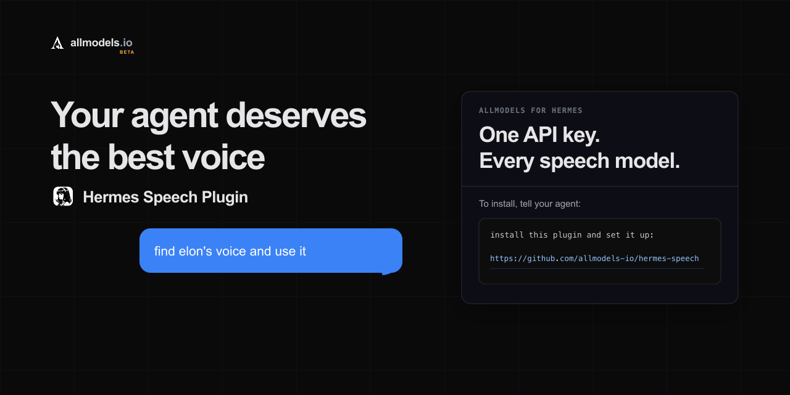

<p align="center">
  
</p>

<h1 align="center">Hermes Speech — TTS &amp; STT Plugin for Hermes Agent</h1>

<p align="center">
  <a href="https://github.com/allmodels-io/hermes-speech/releases/latest"></a>
  <a href="LICENSE"></a>
  
  
</p>

Give [Hermes Agent](https://github.com/NousResearch/hermes-agent) native
text-to-speech (TTS), speech-to-text (STT), streaming audio, searchable voice
previews, and conversational speech setup through [AllModels](https://allmodels.io).
One AllModels API key connects Hermes to every supported speech provider, model,
and voice in the live catalogue.

`hermes-speech` registers `allmodels` as a normal Hermes TTS and transcription
provider. Hermes' existing `/voice` mode, sentence pipeline, messaging gateways,
CLI, TUI, and desktop app continue to work normally. See the
[AllModels Hermes Agent guide](https://docs.allmodels.io/hermes-agent) for the
user-facing walkthrough.

## What it does

- **Native Hermes Agent TTS and STT** — spoken replies and voice-message
  transcription use Hermes' standard provider interfaces.
- **Conversational setup** — tell your agent to set up speech; it handles
  AllModels signup, verification, and compatible starting defaults.
- **Voice search and previews** — find voices by name, description, language,
  gender, provider, or qualities and hear samples before selecting one.
- **Streaming-aware speech** — supported models use streaming TTS; other models
  automatically retain Hermes' synchronous sentence pipeline.
- **Speech management** — change models and voices, tune speed and transcription,
  check balance, create top-up links, test audio, and check for plugin updates.
- **No additional pip install** — it uses the OpenAI and HTTP clients already
  bundled with Hermes.

## Requirements

- Hermes Agent 0.20.0 or later
- No additional Python packages; the plugin uses Hermes' bundled `openai` and
  `httpx` libraries

## Install

The easiest installation is conversational. Send this message to your Hermes
agent:

```text
install this plugin and set it up:
https://github.com/allmodels-io/hermes-speech
```

Or install and enable it from the terminal:

```bash
hermes plugins install allmodels-io/hermes-speech --enable
```

Hermes Desktop users can also use the
[one-click installation link](hermes://plugin/install?repo=allmodels-io/hermes-speech&enable=1).
Hermes will show its normal review and confirmation screen before installing.

Restart a running Hermes CLI, desktop backend, or gateway after installation.

## Quick start

Ask Hermes to configure AllModels speech:

```text
Set up AllModels speech for me.
```

Then enable Hermes' normal voice pipeline:

```text
/voice on
/voice tts
```

Try managing speech in normal conversation:

```text
Find elon's voice and use it.
```

## Conversational speech setup and management

With the plugin enabled, its setup and management tools direct Hermes to the
bundled, namespaced skills
`hermes-speech:configure-allmodels-speech` and
`hermes-speech:manage-allmodels-speech`. Hermes loads the applicable workflow
with `skill_view`. There is no per-message intent hook or fixed sentence list.
Explicit requests for local, offline, Edge, Whisper, or another named provider
remain with Hermes' built-in setup.

Hermes checks the current setup, asks for an email and the single-use code only
when needed, and installs balanced TTS/STT defaults. By default it selects
`fish/s2-1-pro` with Fish voice `Elon Musk(Noise reduction)`
and `soniox/stt-async-v5`, with catalog-ordered fallbacks if a preferred entry
is unavailable.

The setup tool never requires an API key as an argument and never returns one.

After setup, management is conversational too. Requests such as `Find a warmer
voice`, `Switch my STT model`, `Check my AllModels balance`, or `Create a $25
top-up link` use `hermes-speech:manage-allmodels-speech`. Its agent-facing tool
uses the same client, catalog, provider, and settings implementation as the
`/speech` interface; it does not perform signup.

Voice search uses the [AllModels voice catalogue API](https://docs.allmodels.io/voices)
directly. Natural-language queries such as `British female narrator` are ranked
server-side across voice names, descriptions, languages, categories, and labels,
and can span all synchronous TTS models. The plugin does not download or cache
the full catalogue; it retains only a bounded cache of compact metadata for
voices returned by queries. A conversational `preview_voice` action validates
and synthesizes an exact model/voice pair as a temporary MP3 without changing
the configured TTS model, voice, speed, or format, then returns audio through
Hermes' normal `MEDIA:` delivery.

Run `/speech`. If `ALLMODELS_API_KEY` is not configured, Hermes immediately
starts AllModels email signup:

```text
/speech signup you@example.com
/speech verify 123456
```

After verification, setup continues with the TTS author picker. Model setup is
guided as author → model → voice for TTS and author → model for STT.

Useful direct commands:

```text
/speech tts model
/speech tts voice search <name, language, gender, or provider>
/speech tts voice preview <number> [optional sample text]
/speech stt model
/speech balance
/speech topup 25
/speech test Hello from Hermes
/speech advanced speed 1.1
/speech advanced language ja
/speech advanced prompt Product names: Hermes, AllModels
/speech update
```

`/voice` remains the Hermes command for enabling or disabling voice mode.
`/speech` configures which AllModels models and voice Hermes uses.

For conversational speech, enable Hermes' normal pipeline with `/voice on`
followed by `/voice tts`. Hermes splits streamed replies into sentences,
synthesizes each sentence through the registered AllModels provider, and plays
them in order. When the selected catalog binding supports streaming, the plugin
uses Hermes' bundled OpenAI client to yield raw PCM chunks through Hermes'
streaming-TTS pipeline. Other models automatically retain the synchronous,
sentence-pipelined path. Local CLI/TUI/desktop file output keeps Hermes'
requested MP3; messaging gateways that require native voice bubbles use
Ogg/Opus.

## TTS, STT, and voice providers

Hermes Speech reads the live AllModels model and voice catalogues instead of
shipping a fixed provider list. One integration can expose text-to-speech,
speech-to-text, voice search, and streaming audio from supported providers such
as ElevenLabs, Cartesia, Fish Audio, Soniox, and OpenAI-compatible speech APIs.
Models and availability change over time; the
[AllModels model catalogue](https://allmodels.io/models) and
[voice catalogue](https://docs.allmodels.io/voices) are the source of truth.

## Configuration

The plugin registers its bundled workflows with Hermes as read-only, namespaced
plugin skills. It does not modify `skills.external_dirs` or any other discovery
configuration. The skills use the plugin's setup and management tools directly
or through Hermes' deferred tool search. Speech setup writes only its relevant
keys in `config.yaml`. The API key is stored in the profile's protected `.env`
as `ALLMODELS_API_KEY`; it is never displayed after signup.

The model catalogue refreshes automatically in the background. Voice discovery
uses live text search with compact stale-cache fallback. There is no manual
refresh command.

Hermes Speech checks the repository's latest stable GitHub Release in the
background when `/speech` or an agent-facing plugin tool is used. The result is
cached for 24 hours and an available release is mentioned at most weekly until
installed. The checker sends no account, speech, model, voice, or installation
identifier data. Disable automatic checks with:

```yaml
plugins:
  hermes-speech:
    update_check: false
```

Automatic checks only notify. `/speech update` performs the same read-only
release check and, when a release is available, asks the user to request a
host-managed update from their agent. An explicit conversational request such
as `Update the hermes-speech plugin` uses Hermes' normal
`hermes plugins update hermes-speech` path. The plugin never modifies its own
source files.

## Support

- Read the [AllModels Hermes Agent guide](https://docs.allmodels.io/hermes-agent).
- Review the [Hermes Agent voice and TTS documentation](https://hermes-agent.nousresearch.com/docs/user-guide/features/tts).
- Report plugin bugs or request improvements through
  [GitHub Issues](https://github.com/allmodels-io/hermes-speech/issues).

## Development

Run the focused suite from the repository root with Hermes' Python environment:

```bash
python -m pytest -q tests
python -m ruff check .
```
